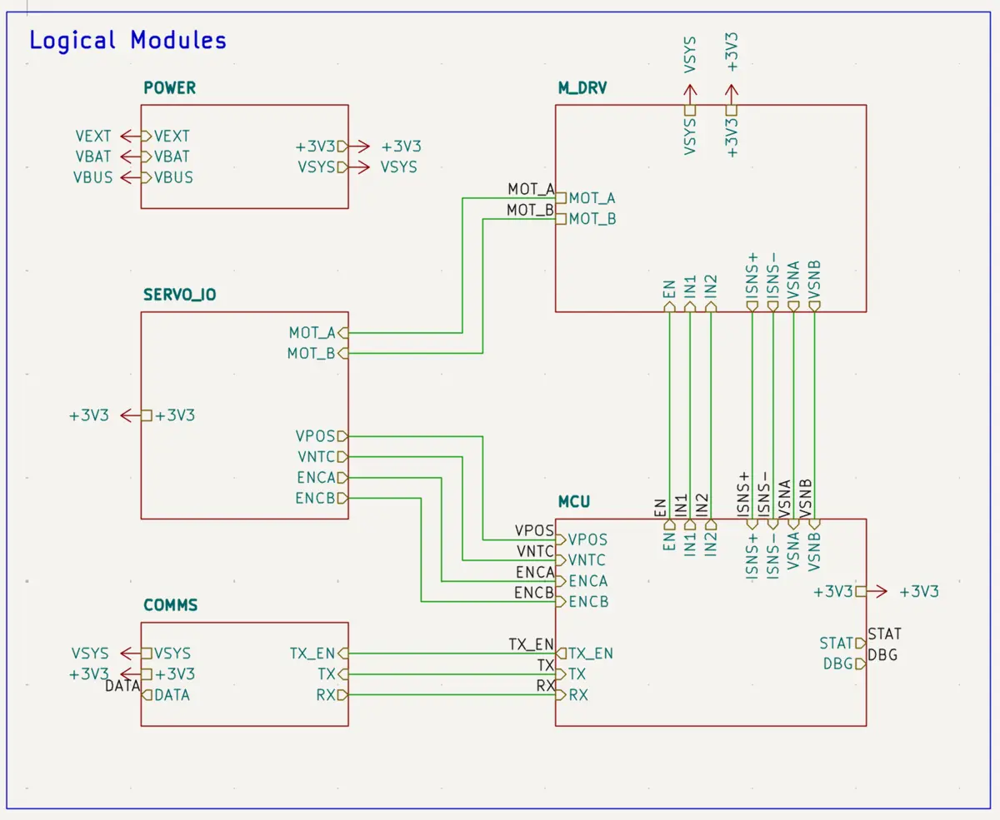
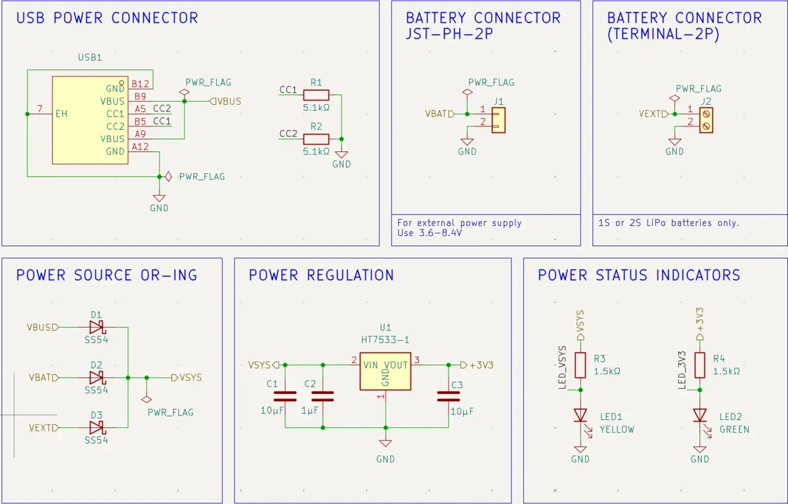
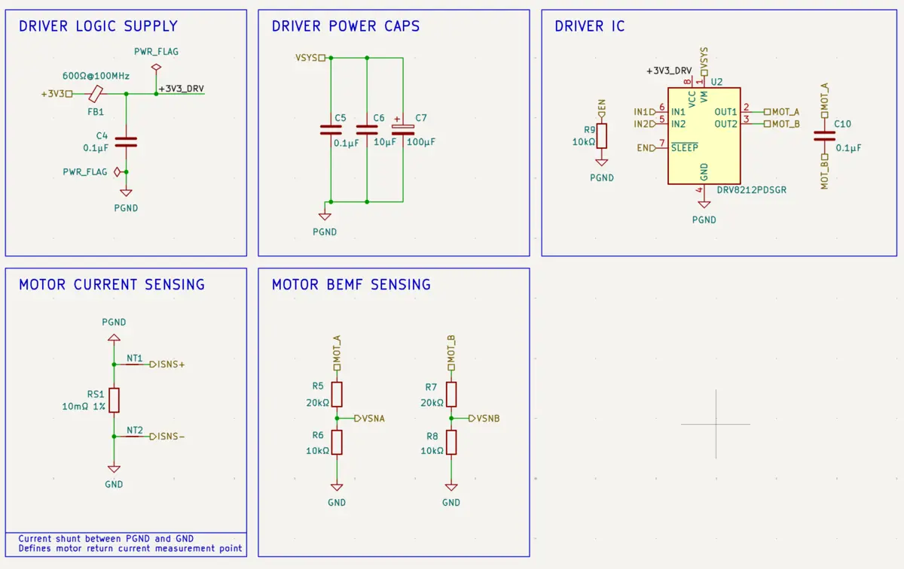
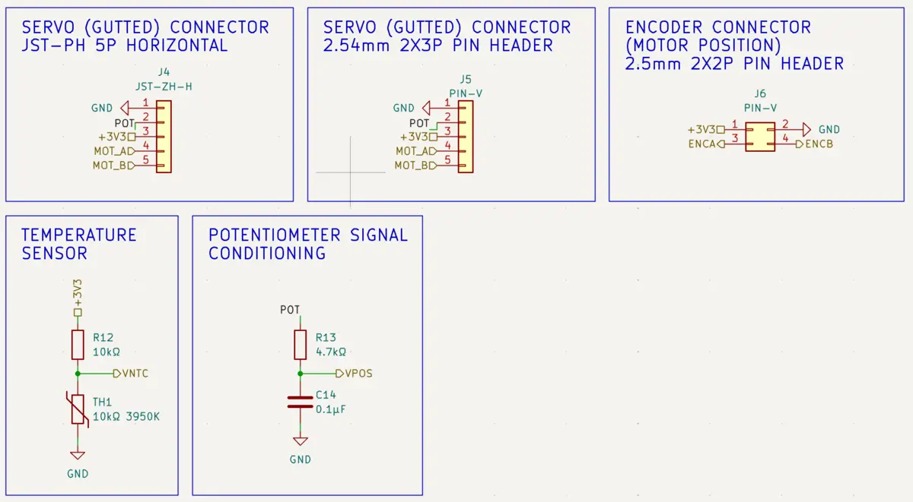
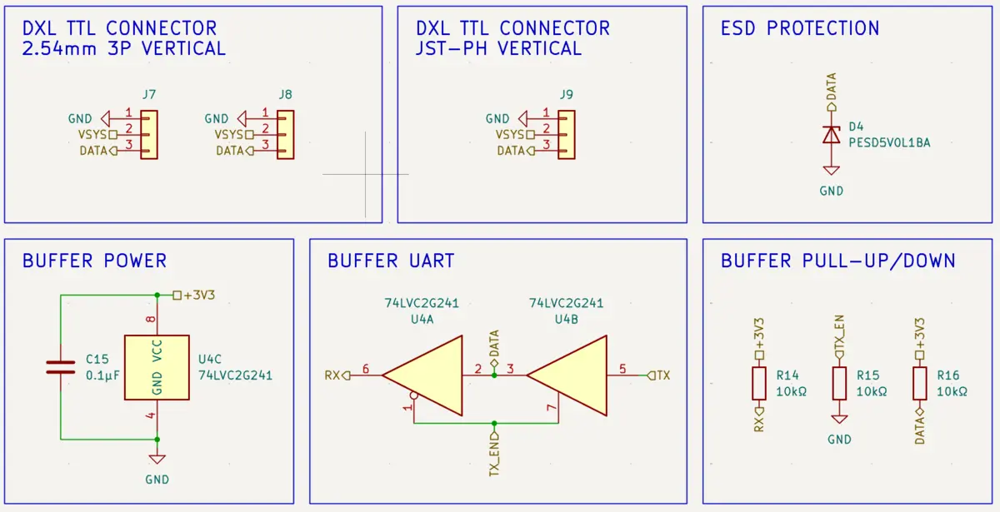
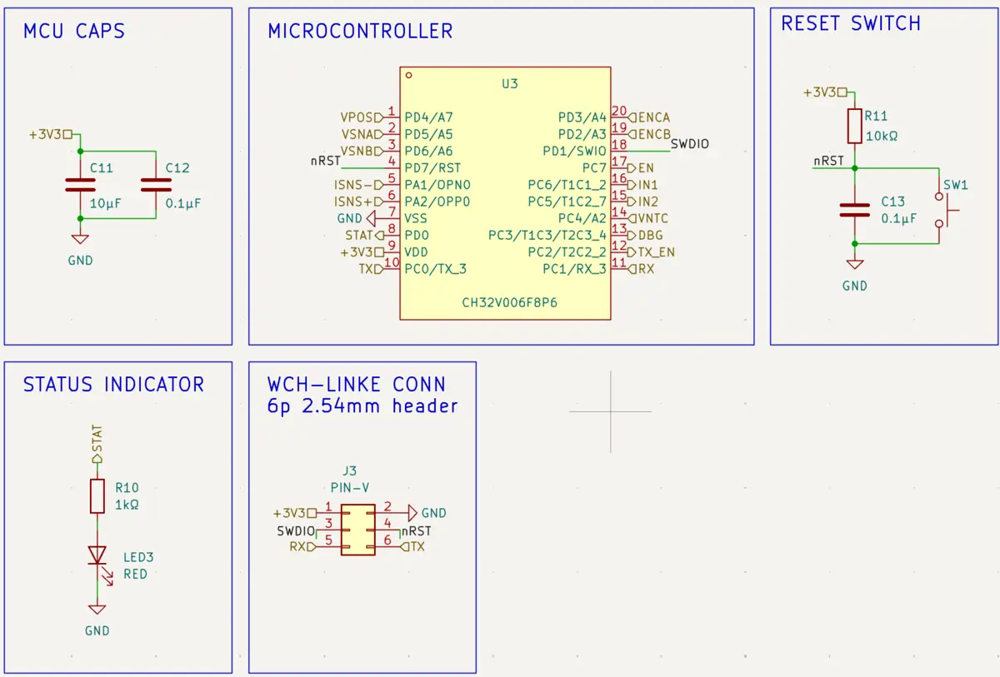
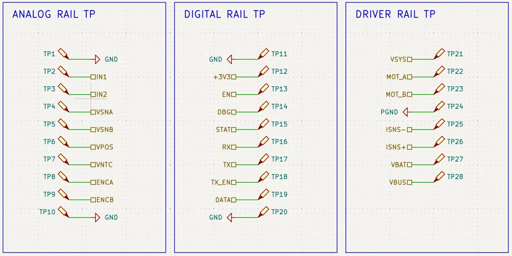

As I mentioned in earlier logs, I am migrating OpenServoCore from an
STM32F301-based architecture to a cheaper CH32V006-based one. The first step was
to create a development board that I could use for firmware development. After a
few weeks of work in KiCad, along with several rounds of PCB review from the
Reddit community, I finally have a design that is ready to share here.

Just in case you landed here with no prior context, this board is intended to
serve as the firmware development platform for OpenServoCore, a project to turn
low-cost servos like the MG90S into smart actuators with cascade control and
DYNAMIXEL-style communication over single-wire UART (DXL TTL).

**Update 04/08/2026**

There were some issues with this board — specifically, VCC/VDD was swapped, and
some silkscreen labels were wrong. I've updated them here, and the images are
now correct.

**Update 04/09/2026:** JLCPCB now has about 2000 units of `CH32V006F8P6` as of
today, which means they can make and assemble the full board without issues.

## Overview

Here is a quick peek at the board.



And here are the top level modules. As the schematics grew and grew, I finally
decided to organize the components into modules and sub-sheets, which gave me
more room for nicer schematic layouts and documentation.

The board is split into the following modules:

- `POWER` - Power Subsystem. It contains different power sources and LDO.
- `SERVO_IO` - Servo IO Subsystem. Used to interface with a gutted servo, and
  some servo related sensors.
- `COMMS` - DXL TTL Subsystem. Single wire UART implementation.
- `M_DRV` - Motor Driver Subsystem. Contains DRV and current / voltage sensors.
- `MCU` - MCU Subsystem. Contains `CH32V006` MCU and associated hardware.
- `DIAGNOSTICS` (not shown) - Test Point arrays.

If you want to take a closer look, you can download the KiCad project at the
[OpenServoCore Github Repository](https://github.com/OpenServoCore/open-servo-core/tree/main/hardware/boards/servo-dev-board-ch32v006).

## Schematic Tour

Compared to the STM32-based dev board, which only had current sensing and a
single power source, this design expands on the old board’s capabilities so I
have more room to experiment with more sophisticated control schemes later on.

### Power

I chose to provide three different ways to power this board:

- **USB-C** - 5V/2A. Standard and portable power for everyday firmware testing.
- **Screw Terminal** - For bench power supply with different voltages.
- **JST (PH)** - Standard LiPo battery for higher amperage / real-world
  application.

I have chosen components to support 3.6V (1S LiPo 80% empty) ~ 8.4V (2S LiPo
full charge) so that the servos can ultimately run directly from LiPo battery
power sources without needing another regulator.

One aspect of the design that took me a long time to finalize was the Power
Source ORing. Initially I wasn't happy about the Schottky diodes (`SS54`)
because they introduce about 500mV of voltage drop. I ran quite a few LTspice
simulations with MOSFET-based schemes and wasn't able to find a way to do it
cheaply for three-way power ORing. Maybe some power engineer can do this with
pure passives only, but after 2 weeks of trial and error, I decided to go back
to the simpler Schottky diodes.

The LDO is the `HT7533-1`. I chose it mainly for its 3V–36V input
voltage, which will work with 1S–2S LiPo batteries. The 200mA of current is also
plenty for the `CH32V006` MCU plus a few passives and LEDs. Another reason is
that it is also very cheap, at about $0.11 per unit. Finally, this is a JLCPCB
_basic_ component, and I try to prioritize basic components as much as possible
to reduce PCB assembly cost.

### Motor Driver

The STM32-based board used current mirroring from the `DRV8231A` motor driver.
To reduce BOM cost, I decided to use the low-cost `DRV8212` instead.
The current sensor is built around a low-side shunt resistor (`RS1`) and a pair
of Kelvin traces (`ISNS+`, `ISNS-`) that lead to CH32V006's internal op-amps
with programmable gain. This increases the footprint a bit, but reduces the cost
per board by about $1 each.

As a result of low-side power shunt current sensing, we now have split ground
(`PGND` and `GND`). A ferrite bead and capacitor are used to try to isolate the
logic ground from the power ground — we'll see how this goes.

The previous STM32 board also didn't have voltage sensing, which limited
visibility into the motor during system control. This board adds voltage sensors
(`VSNA`, `VSNB`) on both motor terminals via voltage dividers. Now it's possible
to sense back-EMF, which opens the door to more accurate control loops. This can
also be used to approximate system voltage.

Lastly, I added a 100uF electrolytic capacitor to reduce current ripple caused
by the servo motor. This should help with voltage and current stability.

### Gutted Servo IO

This module interfaces with a gutted servo (as in the servo with the controller
board taken out) through one of the two servo connectors (`J4` or `J5`). I used
a regular pin header as well as a JST-ZH connector. Personally, I have JST-ZH
connectors wired on my gutted servos, and I'd recommend doing the same
to prevent plugging it backwards at 3AM and creating magic smoke. The gutted
servo should have two wires for the motor terminals (`MOT_A` and `MOT_B`), as
well as 3 wires for the potentiometer (`+3V3`, `POT`, `GND`).

`STM32F301` has an internal temperature sensor that `CH32V006` lacks. I used
this as the baseline for motor winding temperature estimation, so the new board
needs some way to sense ambient temperature to match. This is done via the 10kΩ
NTC (`TH1`). It is very low cost. The `VNTC` net goes to the ADC for temperature
sensing.

Servo position sensing works mostly the same as the previous STM32-based board.
I added a 4.7kΩ/0.1µF RC filter to smooth out jitter as a safety measure.
Probably not needed, but it's extra insurance. The `VPOS` net goes to the MCU
ADC for position sensing.

There are two more ADC channels left on the MCU, and for future expansion, the
most likely use would be an optical quadrature encoder similar to Adam's
ServoProject. So I made a connector with `ENCA`, `ENCB`, `3V3`, `GND` for future
expansions.

### Single Wire UART (Dynamixel TTL style)

I wanted OpenServoCore to be as simple as a board swap. That means you can even
reuse the 3-wire connectors from traditional servos — however, the PWM wire is
now single-wire UART, aka
[DXL TTL](https://emanual.robotis.com/docs/en/parts/interface/dxl_bridge/).

The STM32 dev board only had regular UART connectors. This board integrates
single-wire UART intended to work directly with existing Dynamixel TTL-style
connectors. I implemented this using a `74LVC2G241` dual tri-state buffer,
following the
[Dynamixel Reference Design](https://emanual.robotis.com/docs/en/dxl/x/xm430-w210/#ttl-communication).

One deviation from the reference design is that I removed the non-essential
pull-up on the TX pin and intend to use the internal MCU pull-up instead. I also
tossed in ESD protection on the `DATA` line for good measure.

For connectors, I added two 1x3 pin headers and a JST PH header for the TTL
connectors. This is so we can actually connect standard Dynamixel accessories
and test out compatibility. One fun thing you can do is actually use those
connectors to chain multiple dev boards together to simulate a servo bus.

### MCU

With all the complexities spread across the other subsystems, the MCU block
itself is actually pretty straightforward. The biggest difference here is
obviously the switch to the `CH32V006`, which comes in at around $0.22 a piece,
while the `STM32F301` is closer to $1.85 each, despite being in a fairly similar
class for this project. This is probably the biggest cost savings for this
design.

I chose a 2x3 pin header for the debugger (`J3`). This is intended to be
connected to the WCH-LinkE debugger for firmware programming and debugging. One
interesting feature of the WCH-LinkE debugger is that it also comes with a UART
to USB adapter, which I will be using to send DXL commands to the controller.
Other than that, there is also a status LED and a physical reset switch.

### Diagnostics

Last but not least, I added two horizontal rails and a vertical rail of Test
Point Hooks (`KS-5015`/`RH-5015`) for easy scope / digital analyzer access. I
think this really accentuates the overall design for some reason... I might have
gone a bit overboard, but I'm not regretting it.

## Next Steps

This board took me a while to design, and is honestly the most complex board I
have designed so far. I also learned some cool tricks like inverted text for
silkscreen labels that make the board look even better.

If the first spin gives me a stable platform for bring-up, sensing, motor
control, and DXL-style communication, then it has already done its job. This is
probably the final version (fingers crossed) of the dev board that will act as
the main hardware platform for the OpenServoCore firmware development. Separate
production boards (for lack of a better name) will be designed in the future for
each servo class / type, e.g. SG90, MG90, etc, so they can fit inside the servo
chassis, but will largely follow this overall design.

Finally, JLCPCB ran out of `CH32V006F8P6` and I don't want to purchase them off
AliExpress separately and assemble this myself, so I sent the design to PCBWay
for fabrication and assembly after Reddit community reviews. Hopefully
everything goes well!

As always, you can find the KiCad project on the
[OpenServoCore GitHub repo](https://github.com/OpenServoCore/open-servo-core/tree/main/hardware/boards/servo-dev-board-ch32v006).
