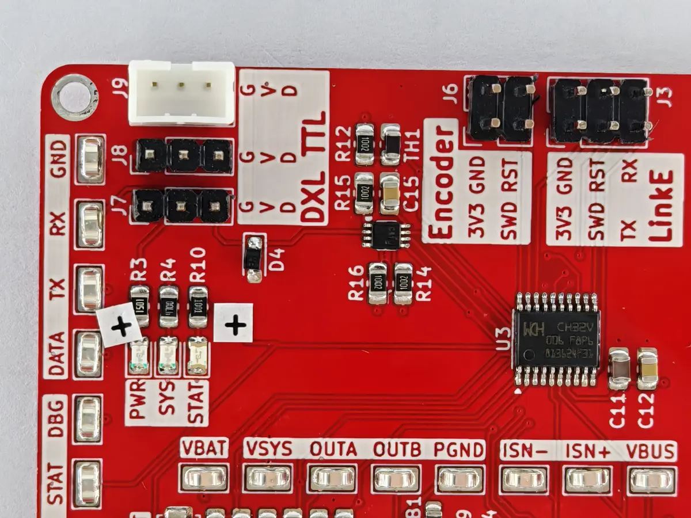
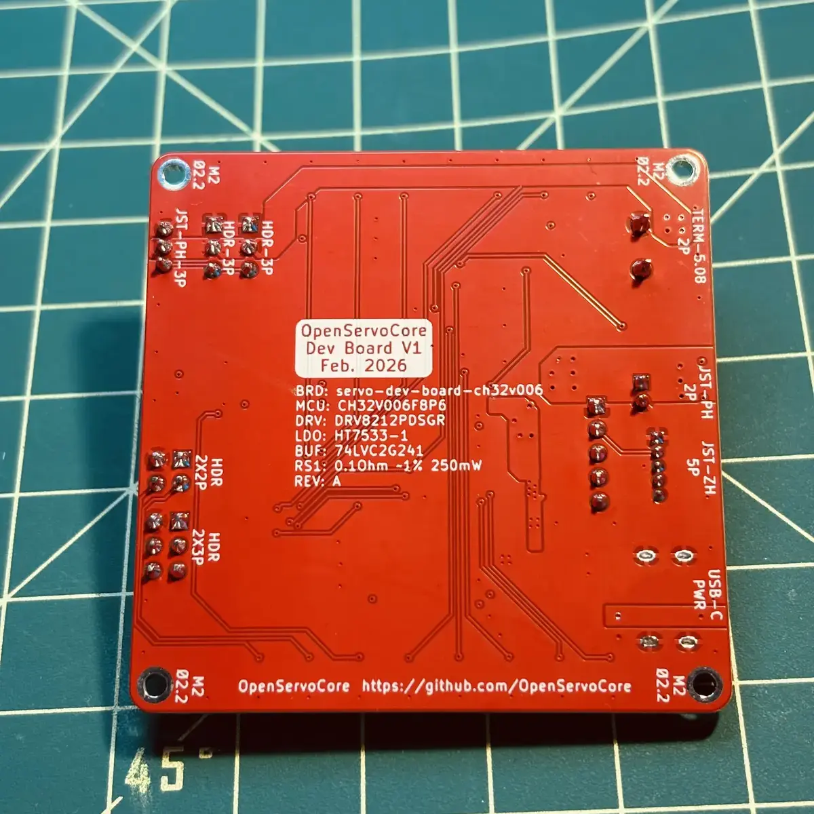

As hinted at the end of my previous log, I sent the design of the CH32V006
OpenServoCore dev board to [PCBWay](https://www.pcbway.com/) for fabrication,
since they were kind enough to sponsor the PCB and assembly for the
OpenServoCore project.

## The Ordering Process

Before I get into the debugging saga, I want to talk about the ordering
experience, because it turned out to be more eventful than I expected (entirely
my fault, as you will soon see is a recurring theme in this post).

After uploading my Gerber files, Chloe from PCBWay's team came back and pointed
out that some of my pad clearances on the `SN74LVC2G241DCUR` dual buffer were
under 0.19mm, which could cause solder mask bridging and potential shorts. The
funny thing is that this was a standard KiCad footprint, and KiCad's own DRC
didn't flag it either. I ended up swapping it for the LCSC footprint, which had
the correct clearances. So before the board even went into production, PCBWay
had already caught a mistake that neither I nor KiCad did.

Then during BOM review, I realized I had submitted the wrong shunt resistor
value for `RS1` (100 mOhm instead of 10 mOhm). The order was already in review,
and I had to sheepishly email them asking for a last minute swap. They updated
it without any fuss. At this point I was starting to wonder how many more of my
own mistakes PCBWay was going to have to deal with before I even got the boards.

Later on, Yilia from their team sent me photos of the assembled boards and asked
me to confirm component orientation and LED polarity before they finished
soldering the through-hole parts. They even placed little paper cutouts with "+"
signs next to the LED anodes so I could easily verify the orientation in the
photos, which I thought was a nice touch.

That kind of back-and-forth is not something I've experienced with other
providers. Most of the time you upload your files, pay, and hope for the best.

In terms of pricing, PCBWay is not the cheapest option out there. But for
someone like me who apparently can't stop making mistakes, having a team that
actually reviews your files and catches problems before they go into production
probably ends up being cheaper in the long run. One less wasted spin pays for
itself pretty quickly.

It's also worth mentioning that at the time of this order, the `CH32V006F8P6`
was not available on either JLCPCB or LCSC. The only way to get it assembled
through JLCPCB would have been to buy the parts off AliExpress and solder them
myself. PCBWay was able to source the parts and assemble the full board, so you
don't have to worry about whether your entire BOM is available on LCSC. They
will find the parts for you.

## Unboxing (Eventually)

After a few weeks, I got a notification that the boards had arrived.

That should've been the easy part. Instead, my first debugging task turned out
not to be the board, but the shipping address. The tracking page said the
package had arrived at my front door, but there was nothing there. After
checking around the house and running around in circles in a panicked daze, I
went back to the order details and realized I had entered the wrong house
number. Embarrassing mistake #1. The package had been delivered to my neighbor
instead. Luckily my lovely neighbor kept it safe for me.

After thanking my neighbor and skipping home like a five year old, I immediately
opened the package. Seeing the red boards in front of me had made my day.

Here is how the first revision turned out:

At this point, I thought the hard part was over. I got my boards safely in my
palm, I just needed to plug it in and start writing firmware. Well, what a
remarkably naive assumption.

## Powering On

When I plugged in the USB-C cable to the board, the first thing I noticed is
that the 3.3V rail LED didn't light up. This is an immediate bad sign, it means
something past the LDO is not working right. I pulled out my multimeter and
measured the voltage on the rail: 0.84V. Board defect? Design error? Bad parts?
My mind raced through different possibilities. The components on the board felt
cold, and I didn't smell any magic smoke, which is a good indication that
nothing is shorted. But to be safe, I unplugged the power and started probing
with my multimeter. Nothing obvious.

Out of ideas, I decided to test the other boards to see if it was a
manufacturing defect. The results came up exactly the same: 3.3V LED not
lighting up. So it wasn't a board defect. It's either the LDO or my design.

To eliminate the possibility of a faulty LDO, I hooked up the `GND` and `+3V3`
rails with an external 3.3V power source. Still 0.84V. The conclusion was clear:
PCBWay did a good job, but my design had failed.

## Debugging

After narrowing it down to a design issue, I hunted through the KiCad PCB design
file looking for misplaced vias, traces, or design violations. Nothing. I stared
at the schematics again. Still nothing suspicious.

Out of options, I started randomly poking around different test points. At some
point, I decided to hook the external 3.3V supply to what was labeled as the
`+3V3` test point hook.

I heard a pop and magic smoke came out. I immediately thought I had just fried
the board. But then, the green LED lit up. I stared at it for a moment,
confused. I measured the `+3V3` rail: 3.3V. What?

Something had clearly burned open, but I couldn't even tell where the pop came
from. Then I looked at the PCB design more carefully and had my second moment of
shame: the top row of test point hooks are all labeled wrong. Embarrassing
mistake #2. I must have been shifting the nets during layout and forgot to
update the silkscreen labels. That "3V3" test point was actually the `EN` pin
between the MCU and the DRV. By feeding 3.3V directly into it, I had fried
either the DRV or the MCU, and whatever burned open had stopped dragging the
3.3V rail down to 0.84V.

To figure out which one was the culprit, I grabbed a fresh board and started
desoldering components one at a time. First the DRV, with a hot air reflow tool.
Plugged it in, still the same. Then the MCU, and the 3.3V LED lit up.

I stared at the MCU schematic for a good 10 minutes, and then it hit me.
Embarrassing mistake #3, and the rookiest one of all: I had swapped VDD and VCC.

## The Board Surgery

With the root cause identified, the fix was conceptually simple: lift the
VCC/VDD leads of the MCU and wire them correctly. Whether it would actually work
was another question. I had no idea if the MCU was still alive after being fed
reverse voltage. But there was no other choice, I had 5 boards and all of them
had the same design error. The only encouraging sign was that nothing had
released magic smoke during normal power-on, which meant the MCU might have
survived.

### Attempt #1

I lifted the VCC/VDD leads on the already desoldered MCU, and reflowed the chip
back onto the board. But during soldering of the tiny magnet wires, I yanked the
VCC lead a bit too hard and it snapped clean off. Out of morbid curiosity, I
decided to power on the board anyway, just to see what would happen.

To my surprise, the debugger recognized the MCU. I wrote a quick blinker app and
flashed it, no issues. The `STAT` LED was permanently on and all GPIO pins read
3.3V due to the disconnected VCC, so it wasn't a functional board, but the MCU
was alive. That was huge.

### Attempt #2

Encouraged, I moved on to board #3. This time, instead of desoldering the entire
MCU, I tried a more targeted approach: cut the trace from the decoupling
capacitor to the VCC lead, then cut and lift the VDD pin from the ground plane.
I went in with the knife, but cut the VDD lead a bit too aggressively and the
whole lead fell off. Another board down. I had to stop, put everything away, and
walk away for the night. Two failed attempts in a row was enough for one day.

### Attempt #3

The next day, with steadier nerves, I came back and reviewed the PCB layout more
carefully. This time I planned every cut before touching the board. The
approach: cut both the decoupling capacitor trace and the ground plane
connection, verify isolation with continuity measurements, and then bridge the
corrected connections with thin magnet wire.

The cutting and scraping went fine. The hard part was soldering the magnet wire.
The leads on the QFP package are tiny, and the wire kept slipping off. I bridged
adjacent leads multiple times and had to wick them clean. The wire wouldn't stay
in place while I tried to tack it down. I found myself holding my breath,
magnifying glasses on, taking deep breaths between each attempt. After about an
hour of shaky hands and generous amounts of flux, I finally got the wires to
behave by pressing them against the body of the MCU. This let me hold the wire
steady while aligning it with the leads precisely. I measured continuity one
more time. Good.

## It Works

I plugged in the board, flashed the blinker app, and the `STAT` LED started
blinking. This means the GPIO block of the MCU didn't get fried by the reverse
voltage and is functioning as if nothing had happened to it. I can't believe it
actually works! Then I brought up UART and that worked too.

With a sigh of relief, I had salvaged the board, with one extra board left for
backup.

It's also worth noting just how resilient the CH32V006 turned out to be. This
chip took reverse voltage on its power pins across multiple power-on cycles and
still came back to life. For a $0.22 MCU, that's pretty impressive. I would not
have expected it to survive, let alone run firmware afterwards.

As for the boards themselves, I did not see any issues with manufacturing and
they are of high quality. If I want to nitpick, the test point hooks are not
aligned perfectly, but that's kind of expected due to how big the TP footprints
are and the reflow process probably caused those hooks to float a bit. This is
purely cosmetic however, and I probably should've used a smaller footprint
anyway.

## What's Next

I pushed out fixes to the design on GitHub and updated my previous post with the
corrected schematics. My next step is to fully verify the board, testing the
DRV, UART buffer, ADCs, and the various sensors. Now that I know which pin is
real power and which one is real ground, hopefully Rev. B will be a smoother
sail.

Three embarrassing mistakes, two failed surgeries, and one working board. I'll
take it.
