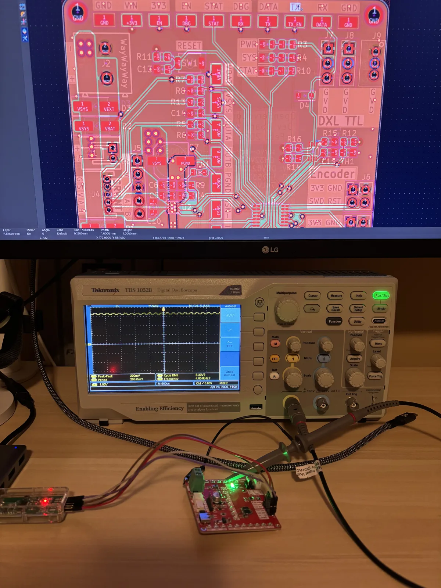
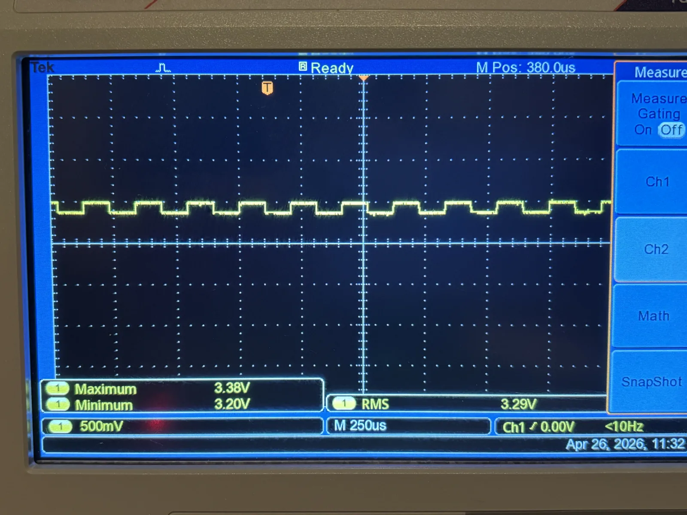

I was working on CH32V00X integration for
[tinyboot](https://github.com/OpenServoCore/tinyboot) on my newly fabricated
[CH32V006 OpenServoCore dev board](https://github.com/OpenServoCore/open-servo-core/tree/main/hardware/boards/servo-dev-board-ch32v006),
thanks to the generous sponsorship from [PCBWay](https://www.pcbway.com/). The
UART controller of this chip shares the same silicon and thus reuses the same
tinyboot HAL driver as the CH32V003. However, the `tinyboot` CLI couldn't talk
to the flashed bootloader via UART at all. This is strange... Same UART silicon,
same HAL driver, but CH32V006 is clearly not responding via UART.

To eliminate the possibility of other driver or init issues, I wrote a separate
UART test app to dig into it more thoroughly. I first wrote a bare minimal app
that just initialized UART using the same HAL driver and sent out "Hello world"
periodically via the TX line. For the PC, I used
[CuteCom](https://github.com/neundorf/CuteCom), a graphical serial terminal.
Immediately I got garbage, but after some RCC tweaks, I was able to get the
right clocks setup to receive TX with no issues.

## TX Works, RX Doesn't

The test app was happily transmitting bytes out over UART, but sending bytes
back was a completely different story. The line was basically silent. It didn't
matter how I tweaked the UART register settings or how many times I read and
re-read the reference manual, I always got silence, nothing was reaching the
chip. Given that the HAL code and the UART controller in the silicon are
essentially the same as the V003, and that "Hello world" was coming out of the
MCU's TX (proving clock init is sound), the only conclusion I could come up with
was that the issue isn't in the firmware. It's in the hardware.

So I moved on to the schematic and the PCB layout, looking for anything wrong: a
swapped pull-up, an inverted wire, anything. The UART TX/RX connector I used for
testing is routed directly from the MCU. The same TX/RX routes also branch off
to a half-duplex DXL TTL front-end. I had a brief suspicion that this might have
something to do with RX not working, but couldn't come up with a plausible
theory to back it up, so I moved on.

## Listening to the Scope

When I ran out of ideas on why RX didn't work, I decided to look at the signal
directly with a scope to isolate whether anything was actually reaching the MCU.
I have a neat one liner for this:

```sh
yes U | tr -d '\n' > /dev/ttyACM0
```

This bash command sends alternating zeros and ones to the MCU's RX line, making
scoping easy. It works like this:

1. `yes U` repeatedly sends out `U\n` to STDOUT. `U` is `0x55` in hex, and
   `0b01010101` in binary, which produces alternating HIGHs and LOWs on the
   scope once the start and stop bits are taken into account.
2. `tr -d '\n'` strips `\n` from the stream, so we have `UUUUUU` forever.
3. `> /dev/ttyACM0` pipes the whole stream into the TTY, in this case my
   WCH-LinkE serial port.

So I hooked up the scope, blasted `UUUUUUUUU` into the RX line, and what I saw
was a square wave, but a teeny tiny one...



Zooming in on the scope:



The waveform was there. The shape was right. But it was riding on top of 3.3 V
with maybe 180 mV of amplitude. The maximum was 3.38 V, the minimum 3.20 V.
Something was holding the line near the rail so hard that my USB UART adapter
could only pull it down by a couple hundred millivolts. This is a big clue!

To rule out the wiring, I touched RX directly to ground. The line snapped to 0 V
cleanly. So the connection was fine. The driver just couldn't win against
whatever was holding RX high.

## The Buffer I Suspected All Along

, R16 pulls DATA up.")

Looking at the TTL DXL front-end again, the RX line goes through a tri-state
buffer (`SN74LVC2G241`) that implements half-duplex direction switching. `TX_EN`
selects the direction:

- `TX_EN` low (default, held by a pulldown): the buffer routes `DATA` to `RX`.
  The MCU listens to the bus.
- `TX_EN` high: the buffer routes `TX` to `DATA`. The MCU talks to the bus.

This is when I had my facepalm moment. I had been picturing the buffer as some
kind of passive switch that just connects two wires together. But after thinking
about it for a few minutes, I realized that's not the case at all.

When `TX_EN` is low, the buffer's output stage is _actively driving_ RX with
whatever it sees on `DATA`. And `DATA` has its own 10K pullup, per the DXL TTL
reference, so when nobody is talking on the bus, `DATA` sits at 3.3 V. The
buffer reads that, and pushes 3.3 V back out through its high-side MOSFET onto
RX. Simplified, RX is pretty much hooked directly to 3.3 V through maybe 20 Ω of
MOSFET resistance, acting as a **strong** pull-up.

So when I was sending bytes from the USB UART adapter into RX, I was not
fighting a passive 10K pullup. I was fighting a CMOS push-pull output stage. The
74LVC2G241 has very low high-side R_DS(on) and 24 mA of drive. A typical USB
UART chip's TX output is much weaker. The two formed a voltage divider, and the
buffer won. The line stayed parked near 3.3 V, with my adapter pulling it down
by a couple hundred millivolts every time it tried to send a 0. That was my
"ripple."

A hard short to ground bypasses that contention entirely, which is why poking RX
with a ground clip snapped it cleanly to 0 V.

## This One Weird Trick... (Sorry)

As absurd as it sounds, the workaround was to assert `TX_EN`, while reading from
RX. Why would I assert the _transmit_ enable when my problem was on the receive
side? Because `TX_EN` isn't really a transmit enable. From firmware's
perspective it's asserted when you talk and deasserted when you listen. But
electrically, it's a mux select that picks which buffer drives the bus. Treating
those as the same thing is what set me up for confusion in the first place.

With it held high, the `DATA` to `RX` buffer is disabled, RX falls back to its
own pullup, and the USB UART adapter can drive it without a fight. Poking 3.3 V
onto `TX_EN` confirmed it in real time:

<figure>
  <video controls muted playsinline loop style="max-width: 100%; max-height: 70vh; display: block; margin: 0 auto; border-radius: 0.5rem; border: 1px solid var(--color-border);">
    <source src="tx-en-fix.mp4" type="video/mp4">
  </video>
  <figcaption>Touching 3.3 V to TX_EN snaps the ripple into a clean rail-to-rail square wave. Release it and the line flat-lines back near 3.3 V. The buffer is the whole problem.</figcaption>
</figure>

For those eagle-eyed viewers, yes. I'm touching the TP that says TX... But the
electric trace is actually TX_EN.


This is another
[embarrassing yet hilarious mistake](/log/2026-04-03-ch32v006-dev-board-first-spin/)
that got its own story, where I somehow "fixed" the issue by creating magic
smoke on my board.

## Why I'm Adding a Jumper

The workaround is assert `TX_EN` in firmware, however, this is not a real fix.
Drive `TX_EN` high in the bootloader's startup code and only release it when the
MCU genuinely wants to talk. It works, costs nothing, and ships today. But it
means UART functionality on this board now depends on the firmware running
correctly.

The right fix should be in hardware by adding a jumper on the RX line. Shorted
means TTL mode, where RX is wired through the buffer as before. Open means plain
UART mode, where RX bypasses the buffer entirely and goes straight to the MCU.
More involved, requires a board respin, and adds a small amount of inconvenience
for the user. But the UART works without any firmware running.

For Rev. B, I'm going with the jumper.

The reason is `wchisp`. That tool, and others like it, use the UART to read and
write the CH32's Option Bytes. Those operations happen _outside_ of any firmware
I write. If my UART hardware depends on my firmware to function, then a
misconfigured Option Byte, a half-flashed bootloader, or a chip fresh from the
factory can lock me out of the recovery path. The whole appeal of UART-based
programming is that it works on a bare chip with nothing running. That property
has to live in hardware, not in firmware.

The rule I'm taking from this: recovery-path peripherals should not depend on
firmware to function. For half-duplex TTL designs specifically, that means the
RX line has to be usable as a standalone UART without anything running on the
MCU. A jumper is a small price to ensure hardware recoverability.

And `TX_EN` is really a line selector, and buffers **actively drives** outputs.
I'll remember that one for a while.
