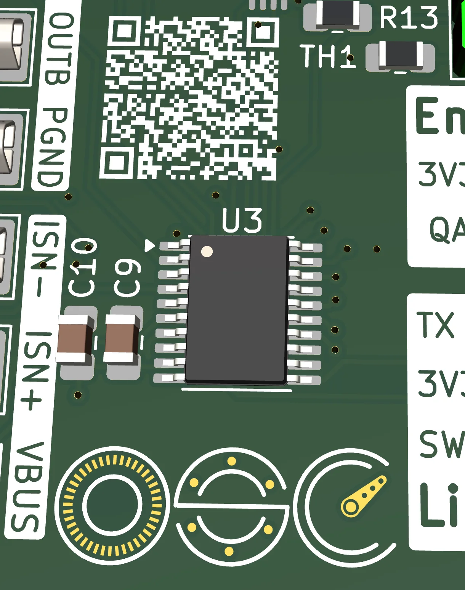

Rev A took board surgery to power on. Then I hit an [RX line that refused to go LOW](/log/2026-04-25-rev-a-uart-rx-stuck-high/). Then I noticed a third defect I never wrote up: the differential current sensing on the OPA wasn't actually differential. Rev B is the respin that fixes all three, plus a handful of features I was going to need anyway.

If you're new here, [OpenServoCore](https://github.com/OpenServoCore) is my effort to turn cheap MG90S-class servos into networked smart actuators with sensor feedback, cascade control, and a DYNAMIXEL-style TTL bus. The CH32V006 dev board is the firmware development platform for this project. Rev B is the second revision of that board, routed this week and ready to fab.

<!--more-->

## TL;DR

> **Status: designed, not fabricated.** I've reviewed Rev B carefully and don't expect another Rev A-scale surprise. But the hardware hasn't been built or validated yet. If you want to fab one yourself, wait for the bringup post. Or fab it at your own risk knowing the design is unproven.

The big-ticket items.

**Fixed:**

- VDD/VCC swap.
- UART RX contention. Added jumper on RX line to select between LinkE or TTL port.
- Various silkscreen label fixes.
- Battery polarity.
- V006 OPA pin mapping for differential current sensing, and as a result:
  - Reset pin & button gone, assigned as OPN2.
  - Hardware fault trip via CMP2.
  - 5V instead of RST pin for WCH-LinkE port.
  - Added VSYS sense to extra pin.

**Added:**

- External NTC connector with onboard / external select jumper.
- PWM servo header for system ID.
- Dual-mode encoder input (TIM2 quadrature or ADC analog).
- First silkscreen logo for the project.

KiCad project: [hardware/boards/osc-dev-v006](https://github.com/OpenServoCore/open-servo-core/tree/main/hardware/boards/osc-dev-v006). Full revision delta in the [CHANGELOG](https://github.com/OpenServoCore/open-servo-core/blob/main/hardware/boards/osc-dev-v006/CHANGELOG.md).



## What's Fixed from Rev A

The fixes are the boring half of the story. They're show-stoppers when they're broken, and invisible when they're right. Five things.

**VDD / VCC swap.** This is _the_ Rev A bug, the one that caused the [MCU surgery saga](/log/2026-04-03-ch32v006-dev-board-first-spin/). Rev B has the schematic right. A fresh chip will power on without magnet wire.

**Top-row test-point silkscreen.** Every label was wrong on Rev A (the photo lives in the [TX_EN debug post](/log/2026-04-25-rev-a-uart-rx-stuck-high/)). The labels are now what the underlying nets actually are.

**Encoder connector labels.** Same story, smaller surface area.

**JST-PH battery polarity.** Was reversed. Now it isn't.

**TX_EN / UART RX contention.** This one came out of the [scope-debug session](/log/2026-04-25-rev-a-uart-rx-stuck-high/) where I figured out the half-duplex buffer was actively driving RX. Rev B adds JP2, a jumper that routes the MCU's RX either through the TTL buffer (DXL mode, normal operation) or floats it (LinkE plain-UART mode, with the LinkE driving RX directly via J4). The point is that UART now works on a bare chip with no firmware running, which is the property that `wchisp` and similar tools actually require. Recovery-path peripherals shouldn't depend on firmware to function. A jumper is a small price for that property.

## What's New

These are the additions, with the differential current sensing piece up front because it's the one Rev A literally can't do. The rest are features I folded in while the respin was happening anyway, mostly aimed at letting the dev board double as a system-ID rig later (motor constants, stock-servo characterization, that kind of thing). Same MCU, same motor driver, same shunt, same DXL bus. One board, three roles. The marginal cost of each was small enough that it would have been silly not to.

### Differential current sensing, actually differential this time

This is the Rev A defect I haven't written up until now, and arguably the most serious one. `ISNS-` was routed to `OPN0`, which isn't a valid negative input for the V006's differential opamp. The only configuration the silicon would actually accept was one where the OPA's negative input was internally tied to ground. Which means the Kelvin sense traces on the GND side of the 10 mΩ shunt were doing nothing. The board was effectively single-ended, sensing the shunt against silicon GND, and could only see current flowing one direction. For a front end whose whole job is to feed a cascade current loop, that's a fatal flaw.

Rev B fixes this. `ISNS-` is now on `OPN2` instead of `OPN0`. `ISNS+` stays on the OPA positive side via `OPP0`. Because `OPN2` shares its package pin with `nRST`, I had to remove the reset button and free up the pin for analog use. This means the USER option byte gets programmed to disable reset-on-NRST at provisioning. See [Pin Remap](#mcu-pin-remap) for the full domino chain that hangs off this one decision.

What this actually buys is worth the trade-off though. Three things, in order of how big a deal each one is.

The first is accuracy. The Kelvin sense traces I'd laid out on either side of `RS1` finally do their job. The OPA differentially measures the voltage across the shunt, instead of measuring single-ended with the negative input bonded to ground. Without actually using the Kelvin traces, the reading will be polluted by voltage drops along the GND return path.

The second, and the bigger deal, is bidirectional visibility. Rev A could only see current flowing _into_ the motor. With differential OPA setup, the board can see current flowing in the other direction too, such as back-EMF during deceleration, regen, freewheeling current through the diodes during PWM off-time. All of these produce reverse current through the shunt, and a correct PI current loop needs the signed integral of that signal, not a clipped one. I'm sure more uses will surface as the firmware gets real (better state estimation, that kind of thing). Back-EMF and regen are the ones I can name with confidence today.

The third is that this is basically free. The shunt and MCU's internal opamp supports this with no extra BOM. The only cost is the hardware reset feature, which I can live without.

### Hardware overcurrent / fault protection (CMP2)

The OPA output also feeds CMP2, the V006's internal comparator. The comparator can be configured to raise a fault on overcurrent and stop PWM generation without firmware runtime involvement. Even if the main loop is hung, the trip still fires through silicon.

With a 10 mΩ shunt, 32x gain on the PGA in self-biased differential mode (VBEN=1, VBSEL=1), and DRV's 4 A peak, the shunt drops ±40 mV at full-scale current. The OPA output sits at a ~1.44 V bias and swings ±1.28 V around it, putting the absolute range at 0.16 V to 2.72 V. This is well inside the ADC's 3.3 V range. The CMP2 negative side can be configured to trip on ~85% of VDD, which is ~2.8 V. This means although it won't trip on this development board on overcurrent (the DRV8212P self-limits at 4 A first), it CAN detect motor shorts and catastrophic current surges. The dev board is designed to be flexible for testing different kinds of servos, but still offer some protection against magic smokes.

For swap boards, the shunt can be sized so that the _fault threshold of the specific servo_ lands near the top of the OPA range. Same role as on the dev board: catch hardware failure, not normal operation. For example, the SG90 datasheet specs a 650 mA stall, but inrush can spike well above that on startup, so we want the trip set with margin, somewhere around ~1.2 A (~2× datasheet stall) to ride above normal operation while still catching motor shorts and jams beyond mechanical stall. With a 35 mΩ shunt (a common 1206 1W value, easy to source), the OPA swings ±1.33 V around the 1.44 V bias at 1.2 A, putting the output at ~2.77 V. That's right at the CMP2 trip threshold of ~2.8 V (VBCMPSEL=10). Normal stall (650 mA) lands at ~2.16 V on the OPA output, comfortably below the trip. Bidirectionally, the ADC sees from −1.30 A (negative rail) to +1.67 A (positive rail) before saturation, plenty of headroom for back-EMF and regen.

### External NTC connector and JP1 source select

The onboard NTC (`TH1`) measures ambient board temperature. That was useful as a stand-in for the V003's lost internal temperature sensor in the first version. It's not what you want during motor-stress testing, where the temperature that matters is the temperature of the motor windings. Rev B adds an external NTC connector (J6) and a jumper (JP1) to pick between the two. Onboard for ordinary firmware-dev work, motor-attached for characterization runs.

### PWM servo header (J3)

A standard 1×3 hobby servo header, driven from `IN1`. With this connector, the encoder, and proper firmware, it opens up the possibility for servo characterization such as positional accuracy, slew rate, error percentage on repeated sweep / return-to-center tests. I have some fun ideas on setting up a rig based on this board to automatically ID a servo by streaming the data using the same single-wire UART protocol.

### Dual-mode encoder input (J8)

`ENCA` and `ENCB` are now pin-mapped to _both_ TIM2 and the ADC. Same 2×2 header, two acquisition modes, picked in firmware. The reason for this is that I didn't want to commit the dev board to one encoder strategy.

In TIM2 mode, the connector takes a standard digital quadrature encoder, magnetic or optical, and counts edges in hardware with no MCU overhead. This is the default mode for motor-speed feedback during motor-ID runs and for any off-the-shelf encoder integration.

In ADC mode, the same pins are sampled by the ADC, which means the connector also accepts ratiometric analog encoders. The specific use case in my head is something like the IR-quadrature sensor stack used in [Adam Bäckström's ServoProject](https://github.com/adamb314/ServoProject), where you read sin/cos directly off a pair of photodiodes, do sub-count interpolation in firmware, and end up with very high effective resolution from a homebrew flex-PCB sensor. Backlash-compensation work and the higher-precision experiments live here.

### VSNS for direct VSYS sensing

Rev A inferred the system voltage from `VSNA` and `VSNB` (the motor-terminal sense dividers). That's fine when the motor is running, but it breaks when it's idle. Rev B adds a dedicated `VSNS` divider so the board measures `VSYS` directly regardless of what the motor driver is doing.

### WCH-LinkE 5 V as a fourth power input (J4 pin 6)

The WCH-LinkE programmer has a `+5V` line to the target board. Since we no longer have `nRST`, this pin is now repurposed in Rev B as a power input, gated by an SS54 into the same OR network as USB-C, the JST battery, and the screw terminal. Now you can use LinkE as the sole power source for the board during development. No need for a separate USB-C cable.

## PCB Art / Logo

I delayed and delayed coming up with a logo for OpenServoCore because one, I'm not really good at graphic design, and two, I just kept on prioritizing PCB / firmware related tasks. But I somehow decided that it was time because I want to actually include a nice looking logo on the Rev B PCB. So, I designed one this week, and it came out better than I thought.

The logo purposefully uses a two-tone design. This is because I can use one tone (white) as the silkscreen for the OSC letters themselves. And then use the golden color of exposed copper for the finer decorative symbols. It came out surprisingly well, given that I'm not a graphic designer.

There's also a small QR code on the silkscreen that points at the docs page for this board. I'd been putting this off for the same reason. This is a board meant for other people, and "scan to read the docs" is pretty much the standard these days.

## MCU Pin Remap

, ISNS+ on OPP0, ENCA/ENCB on dual-purpose TIM2/ADC channels, and STAT on a TIM1 channel.")

The pin map is where the rest of the design rearranges itself around the OPN2 fix. Five things changed.

**`ISNS+` / `ISNS-` → `OPP0` / `OPN2`.** Fixes the Rev A defect where `ISNS-` was on `OPN0` and the OPA could only run single-ended. See [Differential current sensing](#differential-current-sensing-actually-differential-this-time) for the why.

**`nRST` removed.** It shares a pin with `OPN2`, so the OPA fix forced this. The USER option byte gets programmed at provisioning to disable reset-on-NRST. The reset button and its RC debounce network are gone with it. Net pin budget: minus one reset, plus one working differential current sense.

**`ENCA` / `ENCB` selectable between TIM2 and ADC.** Same connector, two acquisition modes, picked in firmware. See [Dual-mode encoder input](#dual-mode-encoder-input-j8) for the why. Pin-map cost was finding channels that have _both_ TIM2 capture _and_ an ADC channel attached, which constrained the rest of the placement more than I expected.

**STAT LED moved to a TIM1 channel.** Gives the LED PWM brightness and pattern control instead of binary on/off. With the remaining pins, one of them happens to be TIM1 CH4 for remap 7. So I'm assigning the STAT LED to this pin for brightness control / breathing etc.

**Board renamed.** `servo-dev-board-ch32v006` → `osc-dev-v006`. Matches the project's naming convention now that the board family is filling in.

## Where to Get It

KiCad project lives in the OSC monorepo under [hardware/boards/osc-dev-v006](https://github.com/OpenServoCore/open-servo-core/tree/main/hardware/boards/osc-dev-v006). The full revision delta is in [CHANGELOG.md](https://github.com/OpenServoCore/open-servo-core/blob/main/hardware/boards/osc-dev-v006/CHANGELOG.md) inside that directory.

There is one more note on component availability. When the first revision went out, JLCPCB had no `CH32V006F8P6` stock at all and PCBWay had to source the chip externally. Now both JLCPCB and LCSC have restocked the part. At the time of writing, there are a couple thousand of them, so if you are confident enough to fabricate one, it should be doable via JLCPCB now.

## What's Next

I don't expect any more serious issues with Rev B. It should just be plug and play. My plan is to order Rev B, do one more pass of validation, and start writing code for the OSC firmware. Most of the bringup work is already done on Rev A. When Rev B arrives, I just need to tweak the register setup a bit and it should be good to go.

The focus now shifts to firmware, fingers crossed.
