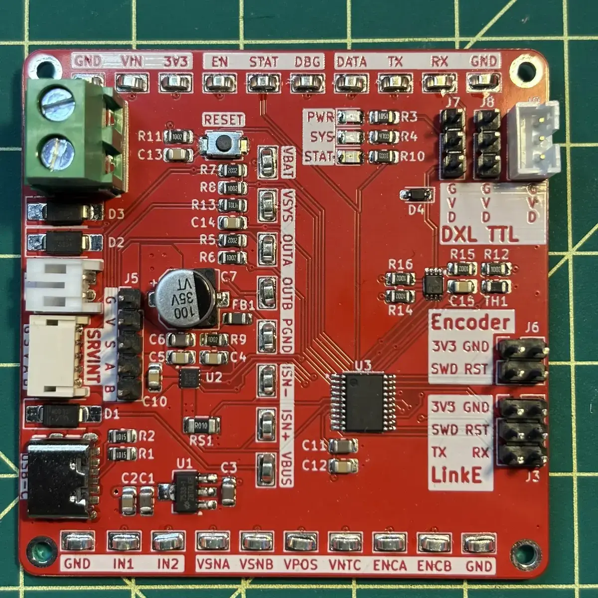
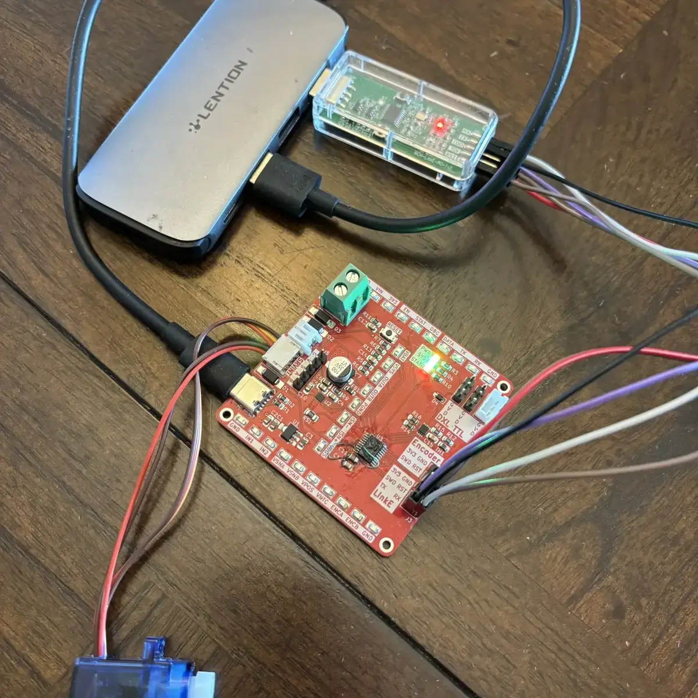

As hinted at the end of my previous log, I sent the design of the CH32V006
OpenServoCore dev board to [PCBWay](https://www.pcbway.com/) for fabrication,
since they were kind enough to sponsor the PCB and assembly for the
OpenServoCore project, and a few days ago, I received a notification that the
boards had been delivered.

## Unboxing (eventually)

That should've been the easy part. Instead, my first debugging task turned out
not to be the board, but the shipping address. The tracking page said the
package had arrived at my front door, but there was nothing there. After
checking around the house and running around in circles trying to it in a
panicked daze, I went back to the order details and realized I had entered the
wrong house number. Facepalm. The package had been delivered to my neighbor
instead. Luckily my lovely neighbor kept the package safe for me, and I was able
to get the package back.

After thanking my neighbor and skipping home like a five year old, I immediately
opened the package. Seeing the red boards in front of me had made my day.

Here is how the first revision turned out:

At this point, I thought the hard part was over. I got my boards safely in my
palm, I just needed to plug it in and start writing firmware. Well, what a
remarkably naive assumption.

## Powering On

When I plugged in the USB-C cable to the board, the first thing I noticed is
that the 3.3V rail LED didn't light up. This is an immediate bad sign, that
means something past the LDO is not working right. I pulled out my multimeter
and measured the voltage on the rail - 0.84V. Board defect? Design error? Bad
parts? My mind raced through different possibilities. The components on the
board felt cold, and I didn't smell any magic smoke coming out of the board. Thi
is a good indication that nothing is shorted. But to be safe, I unplugged the
power and started measuring with my multimeter, and I found nothing.

Out of ideas, I decided to test out other boards to see if it was a board defect
after determining that the risk is fairly low, especially if I just plug it in
for a brief second or two to see if the LED lights up. The results came up
exactly the same: 3.3V LED is not lighting up. This means it was not a
manufacturing issue. It's either the LDO is faulty or something wrong with my
design.

To eliminate the possibility of faulty LDO, I hooked up the `GND` and `+3V3`
rails with an external 3.3V power source. The result is still the same - 0.84V.
So the conclusion is clear, PCBWay did a good job, but my design has failed.

## Debugging

After narrowing down to design issue, I hunted through the KiCad PCB design file
trying to hunt down any misplaced vias, traces, or design violations, and still
couldn't find anything. I looked at the schematics again, and still nothing
popped out as suspicious.

Out of options and ideas, I started randomly poking around different test
points. At some point, I decided to hook the previously used external 3.3V to
the 3.3V test point hook for some reason, and then I heard a pop and magic smoke
came out. Strangely, the green LED lit up. I measured the `+3V3` rail and now
it's 3.3V.

Well, something definitely got shorted open, I thought to myself, but couldn't
identify where that brief pop and smell come from. However, looking at the PCB
design, I got myself another facepalm moment: The top row of the test point
hooks are all labeled wrong. I have no idea how this happened. I guess I was
shifting the nets during design, but forgot to update the labels. That `+3V3`
test point was actually the `EN` pin between the MCU and the DRV. By feeding
3.3V to that pin, I either fried the DRV or the MCU, and this created an open
short that allowed 3.3V to not be dragged down to 0.84V. Now I can narrow down
the design issue to either the MCU or the DRV.

To test which one was the culprit, I decided to use desolder one component at a
time, and then test the `+3V3` rail. With another board, I first desolder the
DRV with a hot air reflow tool, plugged it in, still the same. Then repeated the
same process with the MCU, and vola, the 3.3V LED lit up. So the issue is the
MCU.

I then stared at the MCU design for a good 10 minutes, and then suddenly it
dawned on me that I have made the rookiest mistake of all time. I swapped the
VDD/VCC pins!!

## The Board Surgery

With the root cause identified, the only logical next thing to do is to lift the
VCC/VDD leads of the MCU and reflow the chips back onto the board, and that's
exactly what I did. However, during soldering I yanked VCC lead a bit too hard
it it fell off the MCU. For some reason, I decided to power on this poor board
just to see what would happen. To my surprise, after connecting the debugger,
the software actually recognized the MCU! This is HUGE. I proceeded to write a
blinker app and was even able to flash to the MCU without issues. However, the
`STAT` LED was permanently on. I measure all other GPIO pins, and
unsurprisingly, they are all at 3.3V due to disconnected VCC.

However, this is hugely encouraging, and I proceeded to attempt a second surgery
on board #3. This time instead of desoldering the MCU, I thought to myself, what
if I just cut the trace to VCC lead from the decoupling capacitor, and cut and
lift the VDD pin connected to the GND plane? (They are reversed in the design.)
That turned out to be another failure, I cut the VDD pin a bit too hard, and the
lead fell off again. Only 2 more boards left.

This time, I reviewed the PCB file more carefully, and decided it's better to
just cut both the decoupling capacitor trace as well as the ground plane and
measure continuity to ensure it's truly cut and then solder wires. After a bit
of cutting and scratching I was able to isolate those two leads. The hardest
part was to actually soldering the two thin magnet wires onto the leads and the
near by decoupling capacitors cleanly, but after about an hour or so of shaky
hands and lots of flux, I was finally able to successfully complete this
surgery. After plugging the board in and flashing the blinker app to memory, the
`STAT` LED started blinking. I then proceeded to UART bring up and that worked
as well. With a sigh of relief, I have finally salvage the board with one extra
board for backup.

Here is the post surgery board plugged in:

## What's Next

The next day, I pushed out fixes to my design to Github and updated my previous
post with the correct designs. However, at the time of this article is written,
I still haven't had the time to fully test the board, so I cannot say the board
is fully working, but it's looking like good progress.

My next immediate step is to verify the board is fully functional. Specifically,
testing DRV, UART buffer, ADCs, as well as various sensors to ensure the board
is fully functional. Now that I know which pin is real power and which one is
real ground like a grown up engineer, hopefully Rev. B will be a smoother sail
for me and for anyone who is interested in this project.
